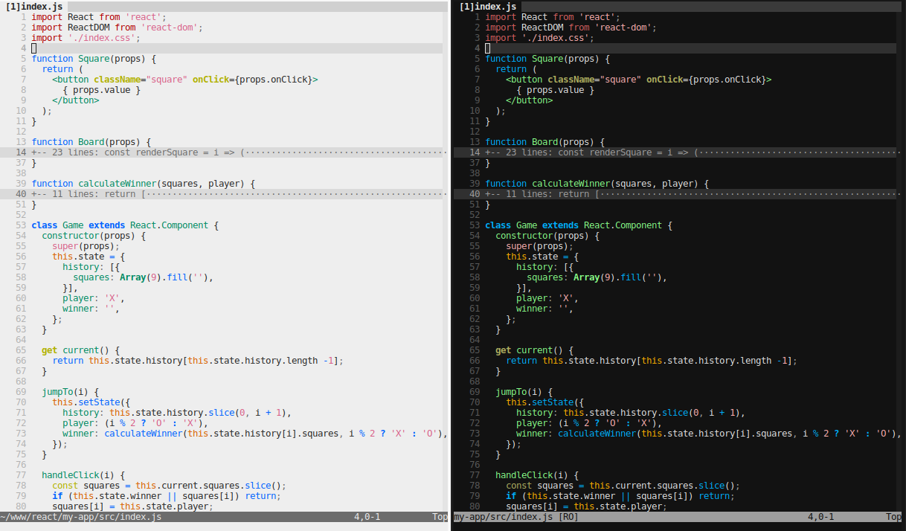

# Kalahari

A [desert][1] / [wombat][2] variant with 256-color and 8-color support.
High contrast for the code content, low-contrast for the user interface.

  [1]: http://www.vim.org/scripts/script.php?script_id=1243
  [2]: http://www.vim.org/scripts/script.php?script_id=2465




## 256-color mode

The default 256-color mode comes in two variants: dark and light.
Set the `background` accordingly:

```vim
" set background=light " for the light version
set background=dark    " for the dark version
colorscheme kalahari
```

A keyboard mapping can be handy to switch between these two variants:

```vim
nmap <silent><F12> :let &bg = (&bg == 'light' ? 'dark' : 'light')<CR>
```


## 8-color mode

The 256-color palette is the same on all terminal emulators. The 8-color
palette (a.k.a. “ANSI colors”) entirely depends on your terminal settings.

All (?) terminal emulators support 256 colors nowadays but the 8-color mode is
interesting to match the terminal theme. This is a fine choice if you prefer
styling your terminal rather than every CLI application, e.g. with a theme
manager such as [pywal][3].

  [3]: https://github.com/dylanaraps/pywal

The 8-color mode can be forced with the `g:kalahari_ansi` variable:

```vim
if has('termguicolors')
    set notermguicolors
endif
set g:kalahari_ansi = 1
colorscheme kalahari
```

In this mode, switching the background color is done on the terminal side, not
on the Vim side: using `set background={dark,light}` adjusts some text colors
to match the background but does not change the background color itself.


## Customization

This color scheme splits is defined in two sections:

* a color palette, which depends on the background (light/dark) and the number of colors (8/16/256);
* a set of highlight rules, which apply colors from the palette to UI elements and syntax groups.

### Color Palette

The color palette can be customized with the `g:kalahari_palette` variable.
Changing the comment colors from gray to purple can be done like this:

```vim
let g:kalahari_palette = {
\ 'Comment': 134,
\}
colorscheme kalahari
```

Or, if you prefer to specify colors from all color modes (8/256 & light/dark backgrounds):

```vim
let g:kalahari_palette = {
\ 'Comment': [ 5, 5, 177, 134 ],
\}
colorscheme kalahari
```

The palette identifiers are taken from these lists:

* default text and separator colors (gray scale — higher number means lower contrast):
    * `fg_1`, `fg_2`, `fg_3`, `fg_4`, `fg_5` for the text, `fg_1` being the default text color
    * `bg_1`, `bg_2`, `bg_3`, `bg_4`, `bg_5` for the separators, `bg_1` being the default background color
* UI colors: `NonText`, `ModeMsg`, `Question`, `SpecialKey`, `Search_bg`, `Visual_bg`, `WarningMsg`, `Cursor`, `Cursor_bg` — see `:h highlight-groups`;
* syntax colors: `Constant`, `Identifier` `Statement`, `PreProc`, `Type`, `Special`, `Underlined`, `Comment`, `Ignore`, `Error`, `Error_bg`, `Todo`, `Todo_bg` — see `:h group-name`.


### Highlight Groups

Highlight groups can be redefined with the `g:kalahari_groups` variable. The foreground & background should be a name from the color palette, but a numeric value can be used as well if you want to keep the same color in both dark & light modes.

```vim
"    group name      foreground   background         decoration
let g:kalahari_groups = [
\  [ 'CursorLine',   '',          'bg_1',            'underline' ],
\  [ 'StatusLine',   16,          'Visual_bg',       'none'      ],
\  [ 'TabLineSel',   16,          'Visual_bg',       'none'      ],
\]
colorscheme kalahari
```


## Related Color Schemes & Plugins

The following color schemes also have dark & light variants that can be
selected by setting the `background` accordingly:

* [rakr/vim-one](https://github.com/rakr/vim-one) (my personal favorite ;-))
* [rakr/vim-two-firewatch](https://github.com/rakr/vim-two-firewatch)
* [noahfrederick/vim-hemisu](https://github.com/noahfrederick/vim-hemisu)
* [freeo/vim-kalisi](https://github.com/freeo/vim-kalisi)
* [zanglg/nova.vim](https://github.com/zanglg/nova.vim)
* [MvanDiemen/ghostbuster](https://github.com/MvanDiemen/ghostbuster)
* [chmllr/elrodeo-vim-colorscheme](https://github.com/chmllr/elrodeo-vim-colorscheme): a low-contrast `ghostbuster` variant
* [lifepillar/vim-solarized8](https://github.com/lifepillar/vim-solarized8): a `solarized` variant that works on Neovim

The color schemes below look nice too but I couldn’t make them work properly with Neovim:

* [altercation/vim-colors-solarized](https://github.com/altercation/vim-colors-solarized): official `solarized` theme
* [Slava/vim-colors-tomorrow](https://github.com/Slava/vim-colors-tomorrow): another `solarized` variant
* [jsit/disco.vim](https://github.com/jsit/disco.vim)

These plugins may also be worth mentioning:

* [rakr/vim-togglebg](https://github.com/rakr/vim-togglebg), to manually toggle the background between dark and light modes;
* [amdt/sunset](https://github.com/amdt/sunset), to automatically toggle the background mode when the sun rises and sets.
